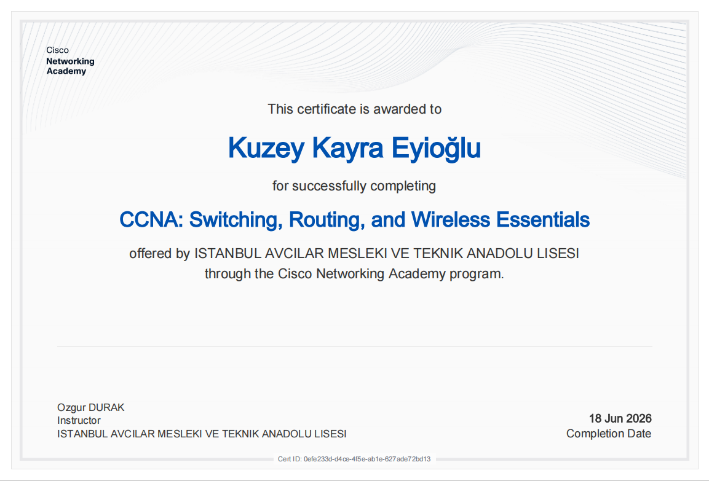
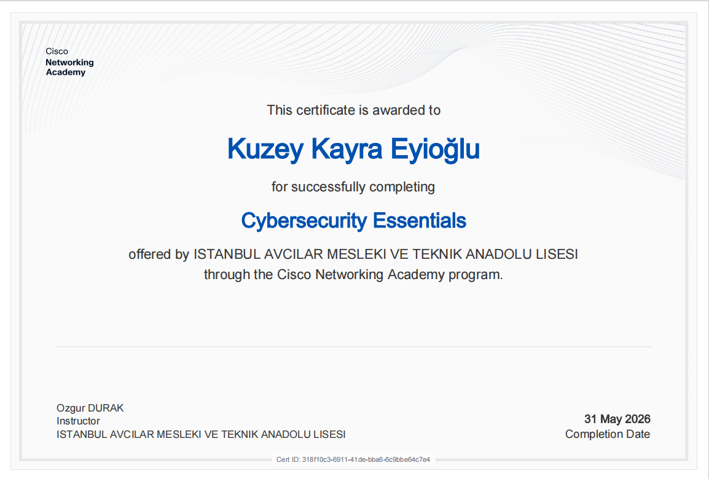
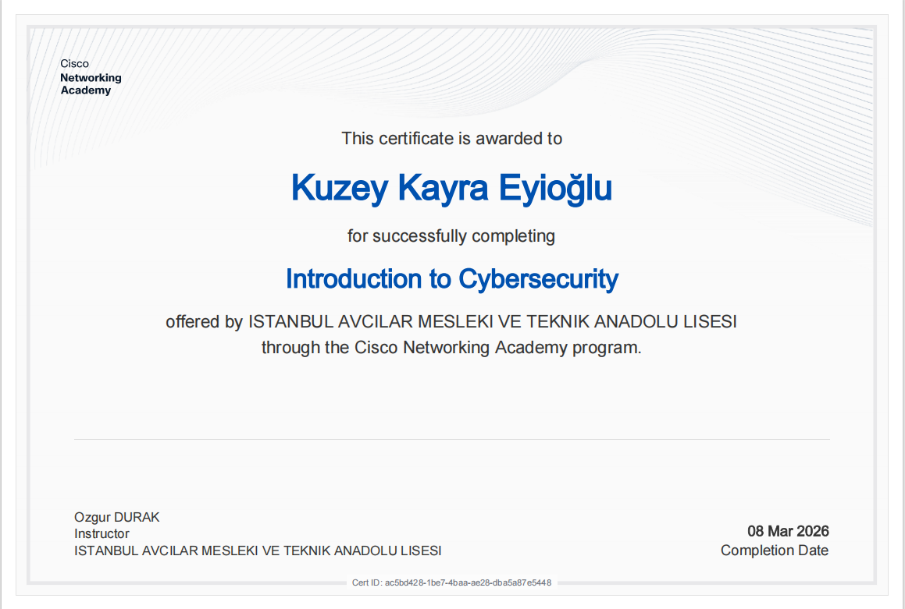
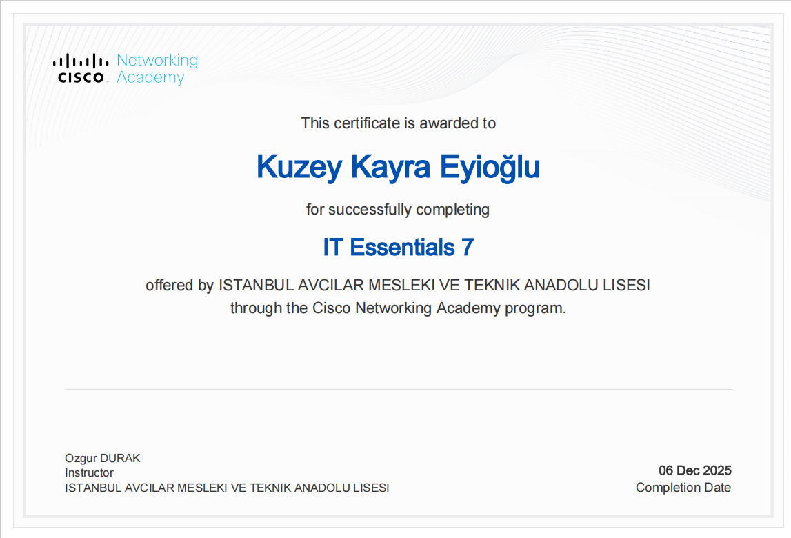

# Hi, I'm Kuzey 👋

🎮 High school developer from Türkiye  
🛠 Building Unity games, Blender tools & Python projects  
📚 Learning C#, Python, game development & computer science  

---

## 🚀 Current Projects

### 🏠 [Blender Procedural Room Generator](https://github.com/KuzeyKayraEyioglu/blender-procedural-room-generator)
A Blender add-on for generating editable procedural rooms with roofs, openings, doors, lighting and materials.

### 🎮 CapsuleArena
A fast-paced multiplayer FPS built with Unity, featuring tactical combat, optimized environments, custom assets and competitive game modes.

### 📈 CS50 Finance Project
A Flask + SQLite stock simulation web app with live updates and analytics.

### 🧠 MindCore
An experimental AI architecture focused on memory, reasoning, goals, emotions and autonomous decision-making.

---

## 🛠 Tech Stack

---

## 🌱 Currently Learning

- Advanced Unity systems
- Blender add-on development
- C# & Python
- Computer Science (CS50)
- English (towards C1/C2)

---

## 🏆 Certifications

  

  

  

  

  Certificates issued through the Cisco Networking Academy program.

---

## 🎯 Goals (2026–2027)

- Build a strong GitHub portfolio
- Release useful Blender add-ons
- Publish indie games
- Improve English to C1/C2
- Contribute to open-source projects

---

📺 Project Showcases & Devlogs

[Visit My YouTube Channel](https://www.youtube.com/@KuzeyKayraEyio%C4%9Flu)

---

## 📊 GitHub Stats

---

> “Building games, tools and learning something new every day.”
